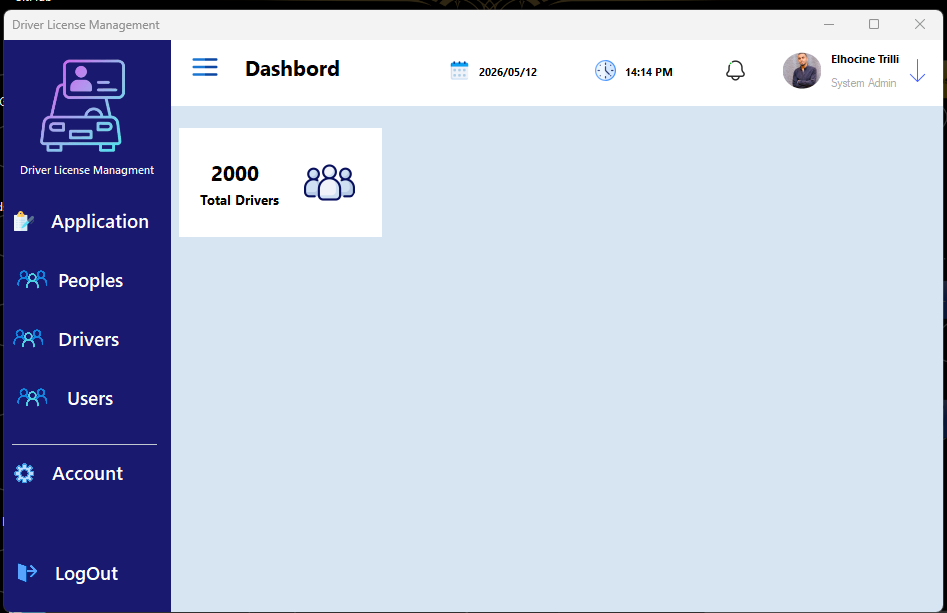

# DVLD Project

Driving & Vehicle License Department System built using Three Layer Architecture.

## Technologies Used
- C#
- WinForms
- SQL Server
- ADO.NET

## Architecture
- Presentation Layer
- Business Layer
- Data Access Layer

## Features
- Manage Users
- Manage Drivers
- License Services
- Local & International Licenses

## Dashboard

Screenshots/Screenshot 2026-05-12 141509.png
